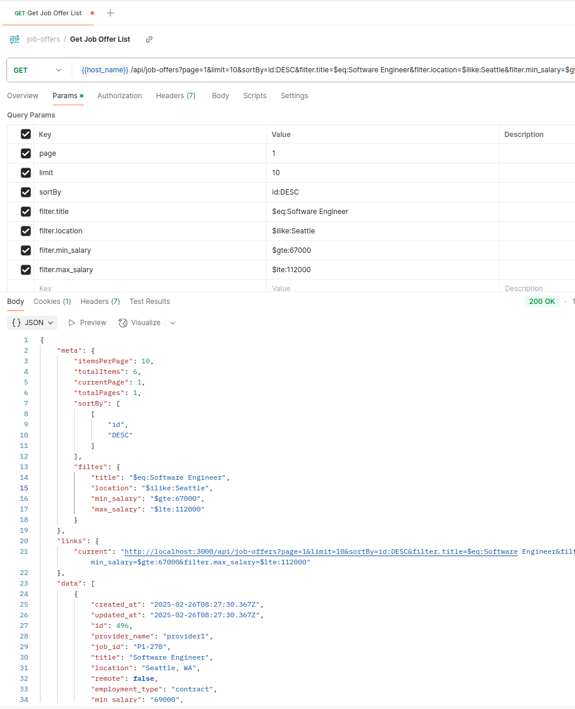

# job-offer-connector

# About

A TypeScript-based Sample that integrates, transforms, and serves job offer data from multiple APIs with filtering and pagination support.

## Getting Started

1. Clone the project and go to its folder

```bash
git clone https://github.com/MahdadGhasemian/job-offer-connector.git
cd job-offer-connector
```

2. Install dependences

```bash
pnpm install
```

3. Copy .evn.example to .env and Change its database port and other things if need

```bash
cp .env.example .env
```

4. (optinal) To run an instance of Postgresql for testing you can use docker-compose.yaml file
   Note: It only contains a Postgresql instance (also pgadmin if be uncommented)

5. Run The Project

```bash
# Run
pnmp run start

# Watch Mode
pnpm run start:dev
```

## 🧪 Run Tests

### ✅ Unit Tests

Run unit tests:

```bash
pnpm run test
```

### 🔄 End-to-End (E2E) Tests

Run E2E tests:

```bash
pnpm run test:e2e
```

## Swaggers (API Doc)

- [http://localhost:3000/api-docs/](http://localhost:3000/api-docs/)

## Retrive job offers

It support pagination and fully flexible filters


